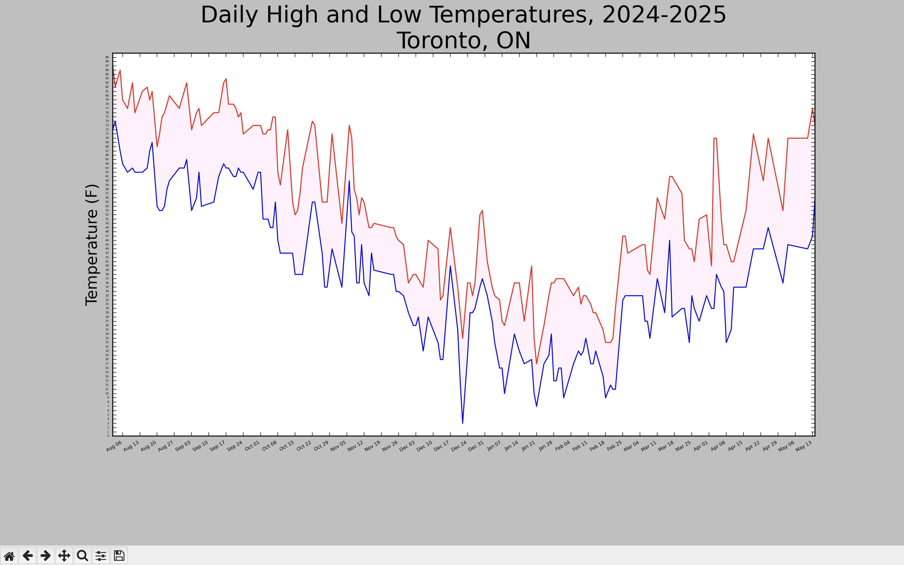
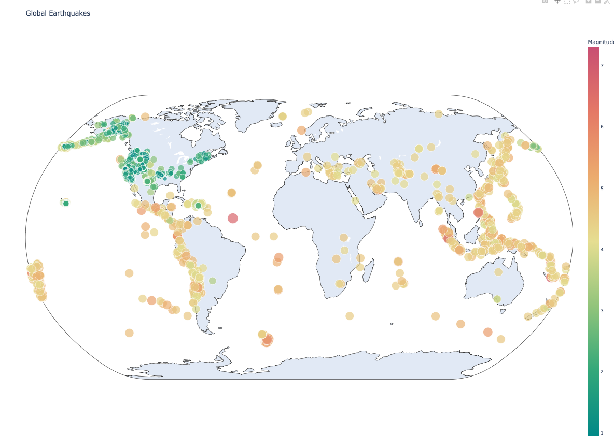

# 🌦️ Weather & 🌍 Earthquake Visualization Project

This Python project visualizes real-world weather and earthquake data using **Matplotlib** and **Plotly**.

---

## 🔍 Project Overview

### 1. **Daily Weather Visualization**
- Reads weather data from a CSV file
- Plots daily high (red) and low (blue) temperatures
- Shaded area between highs and lows
- Weekly x-axis ticks with readable date formatting
- Dynamically sets the chart title based on the station name
- Handles missing or malformed data gracefully

### 2. **Global Earthquake Map**
- Loads recent earthquake data from a GeoJSON file
- Interactive world map using Plotly
- Bubble size and color represent magnitude
- Hover to view location and magnitude details

---

## 📊 Sample Output

### Weather Plot


### Earthquake Map


---

## 🚀 How to Run

### Prerequisites

- Python 3.x
- Install required packages:

```bash
pip install matplotlib plotly